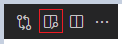

## 1. 마크다운을 지원하는 에디터를 실행

나는 Visual Studio Code 에디터를 선택했다. 에디터를 열고 Jekyll 테마 내용물이 들어 있는 `[github_id].github.io` 이름의 로컬 폴더를 열어준다.

## 2. \_post 폴더를 생성

`[github_id].github.io` 이름의 로컬 폴더 위치에 \_posts 폴더를 생성해 준다. 모든 포스트 파일은 이 \_posts 내에 위치하여야 한다.

## 3. yyyy-mm-dd-title.md 형식의 파일 생성

포스트 파일의 확장자는 `.md`여야 한다. `yyyy-mm-dd`형식의 날짜와 함께 포스트제목(title)을 붙여 `yyyy-mm-dd-title` 형식의 제목을 만들어 준다. 포스트 제목을 영어로 쓴다.

## 4. 머릿말(Front-Matter) 작성

이제 포스트를 작성해 보자. md 파일의 상단에 포스트의 정보를 머릿말로 적어 준다.

```
---
title:  "[Jekyll] 블로그 포스팅하는 방법"
excerpt: "마크다운 파일을 작성하여 Github 원격 저장소에 업로드 해보자. 에디터는 Visual Studio code 사용! 로컬 서버에서 확인도 해보자."

categories:
  - Blog
tags:
  - [Blog, jekyll, Github, Git]

toc: true
toc_sticky: true

date: 2021-12-02
last_modified_at: 2021-12-03
---
```

Front-Matter의 위, 아래에 `---`을 써서 머릿말을 쓰는 영역을 구분해주어야 한다.

**title** : 포스트의 제목을 큰 따옴표로 적어 준다. 이 title을 적어주지 않으면 `.md`파일 이름으로 적어 주었던 title 부분이 제목으로 업로드 된다.

excerpt : 포스트 목록에서 보여지는 소개글을 적어 준다.

categories : 포스트의 카테고리를 지정해 준다. 나중에

toc : Table of Contents, 포스트의 헤더를 보여주는 목차를 사용할지 여부. true로 주면 포스트의 목차가 보이게 된다.

toc_sticky : true로 하면 목차가 스크롤을 따라 움직인다. 이밖에 toc_icon, toc_label도 설정할 수 있다.

date : 글을 작성한 날짜. yyyy-mm-dd 형식으로 작성.

last_modified_at : 이 글을 마지막으로 수정한 날짜.

이 밖에도 layout, permalink, published 등 머릿말에 쓰이는 여러 변수들이 있다. 원하는 변수를 머릿말에 지정해서 사용할 수 있다.

머릿말에 쓰인 변수는 Liquid 변수로 사용될 수 있다. 예를 들어 머릿말에 적인 categories 변수 값은 Blog 이므로 Liquid언어로 `{{page.categories}}`를 본문에 쓰면 `Blog`가 출력될 것이다.

참고 : [Liquid 언어 문서](https://shopify.github.io/liquid/)

## 5. 포스트 내용을 Markdown 문법으로 작성

머릿말 `---`이 끝난 이후부터 포스트의 본문 영역이다. jekyll은 `HTML`과 `Markdown`을 지원하는데 마크다운을 사용하면 HTML보다 더 간략하고 편하게 본문을 작성할 수 있다.

## 6. 마크다운으로 쓴 포스트 내용을 미리 보는 방법

Visual Studio Code에서 마크다운으로 작성한 문서가 웹에서 어떻게 보일지 미리 확인하려면 우측 상단에 `측면에서 미리 보이 열기` 아이콘을 클릭한다.



위 아이콘을 클릭하면 우측에 새로운 탭이 생기고 마크다운으로 작성한 문서가 웹에서 어떻게 보이는지 확인할 수 있다.
