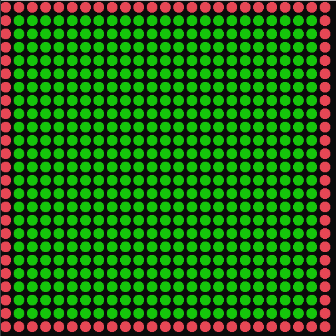

## 미로 맵 준비



- 맵은 원형 타일이 한칸씩 이어져서 만들어진다
- 미로는 이차원 배열로 관리
- 가장 자리의 타일들은 벽이며 빨간색으로 표시한다
- 초록색 타일들은 갈 수 있는 곳이다

### Board.cs

```csharp
using System;
using System.Collections.Generic;
using System.Text;

namespace Algorithm
{
    class Board
    {
        const char CIRCLE = '\u25cf';  // 원 그리는 문자 코드

        public TileType[,] _tile;  // 맵 배열. 2차원 배열
        public int _size;  // 맵 크기 _size X _size

        public enum TileType
        {
            Empty,   // 갈 수 있는 타일
            Wall,    // 갈 수 없는 타일
        }

        public void Initialize(int size)
        {
            _tile = new TileType[size, size];
            _size = size;

            for (int y = 0; y < _size; y++)
            {
                for (int x = 0; x < _size; x++)
                {
                    if (x == 0 || x == _size - 1 || y == 0 || y == size - 1)   // 가장 자리의 타일들을 벽으로 정의
                        _tile[y, x] = TileType.Wall;
                    else   // 가장 자리가 아닌 타일들은 갈 수 있는 곳으로 정의
                        _tile[y, x] = TileType.Empty;
                }
            }
        }

        public void Render()
        {
            ConsoleColor prevColor = Console.ForegroundColor;  // 원래 색 기억

            for (int y = 0; y < _size; y++)
            {
                for (int x = 0; x < _size; x++)
                {
                    Console.ForegroundColor = GetTileColor(_tile[y, x]);
                    Console.Write(CIRCLE);  // 동그라미 1개 그림
                }
                Console.WriteLine();  // 개행
            }

            Console.ForegroundColor = prevColor;  // 원래 색 리턴
        }

        ConsoleColor GetTileColor(TileType type)
        {
            switch(type)
            {
                case TileType.Empty:  // 갈 수 있는 곳이면 초록색
                    return ConsoleColor.Green;
                case TileType.Wall:  // 갈 수 없는 벽이면 빨간색
                    return ConsoleColor.Red;
                default:  // 디폴트는 초록색 리턴
                    return ConsoleColor.Green;
            }
        }
    }
}

```

### Program.cs

```csharp
using System;

namespace Algorithm
{
    class Program
    {
        static void Main(string[] args)
        {
            Board board = new Board();
            board.Initialize(25);

            Console.CursorVisible = false;

            const int WAIT_TICK = 1000 / 30;

            int lastTick = 0;
            while (true)
            {
                #region 프레임 관리
                int currentTick = System.Environment.TickCount;  // 밀리 세컨즈로 나타낸 현재시간.  1 밀리 세컨즈 = 1/1000 초
                int elapsedTick = currentTick - lastTick; // 경과 시간(현재시간 - 마지막으로 잰 시간)

                if (elapsedTick < 1000 / 30) // 경과한 시간이 1/30초보다 작다면 아래 과정을 처리 하지 않고 돌아감. 즉 30프레임 기준, 한 프레임 당 한번 처리되도록!
                    continue;
                lastTick = currentTick;  // 1/30초, 즉 한 프레임이 경과 되었다면 마지막 측정 시간을 현재 시간으로 업뎃
                #endregion

                // 1.입력
                // 2.로직
                // 3.렌더링
                Console.SetCursorPosition(0, 0);
                board.Render();  // 미로 렌더링
            }
        }
    }
}

```
