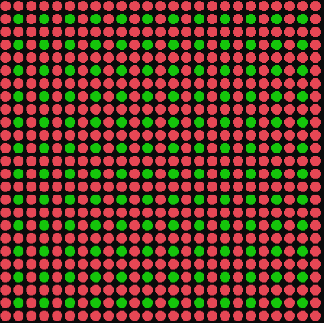

## 미로 준비

이전 Chapter에서는 가장자리만 벽으로 만들었지만, 이번에는 진짜 미로처럼 길을 만들어본다.

미로 생성 알고리즘

- Binary Tree
- Side Winder

### 1. 가장자리 벽으로 채우기

```csharp
public void Initialize(int size)
{
    _tile = new TileType[size, size];
    _size = size;

    for (int y = 0; y < _size; y++)
    {
        for (int x = 0; x < _size; x++)
        {
            if (x == 0 || x == _size - 1 || y == 0 || y == size - 1)
                _tile[y, x] = TileType.Wall;
            else
                _tile[y, x] = TileType.Empty;
        }
    }
}
```


### 2. 짝수 열이나 행은 벽으로 만들기

```csharp
public void Initialize(int size)
{
    _tile = new TileType[size, size];
    _size = size;

    for (int y = 0; y < _size; y++)
    {
        for (int x = 0; x < _size; x++)
        {
            if (x%2 == 0 || y%2 == 0)
            {
              _tile[y,x] = TileType.Wall;
            }
            else
            {
              _tile[y,x] = TileType.Empty;
            }
        }
    }
}
```



- 이렇게 하면 벽이 아닌 곳(TileType.Empty)은 사방이 벽으로 둘러싸이는 형태가 된다.
- 이 상태에서 초록 타일을 기준으로 오른쪽 or 아래쪽으로 랜덤하게 벽을 뚫어서 길을 만들어 준다.

### 3. Binary Tree 알고리즘

랜덤하게 두 방향(오른쪽, 아래쪽) 중 하나를 선택해 길을 뚫어줌

```csharp
  // 미로 만들기 전, 길을 다 막아버리는 작업
  for (int y = 0; y < _size; y++)
  {
      for (int x = 0; x < _size; x++)
      {
          if (x % 2 == 0 || y % 2 == 0 )
              _tile[y, x] = TileType.Wall;
          else
              _tile[y, x] = TileType.Empty;
      }
  }

  // 길을 반반 확률로 뚫는 작업
  Random rand = new Random();
  for (int y = 0; y < _size; y++)
  {
      for (int x = 0; x < _size; x++)
      {
          if (x % 2 == 0 || y % 2 == 0)
              continue;
          if(rand.Next(0, 2) == 0)  // 0, 1 중 랜덤하게 하나를 뽑음
          {
              _tile[y, x + 1] = TileType.Empty;  // 오른쪽 뚫기
          }
          else
          {
              _tile[y + 1, x] = TileType.Empty;  // 아래 뚫기
          }
      }
  }

```
