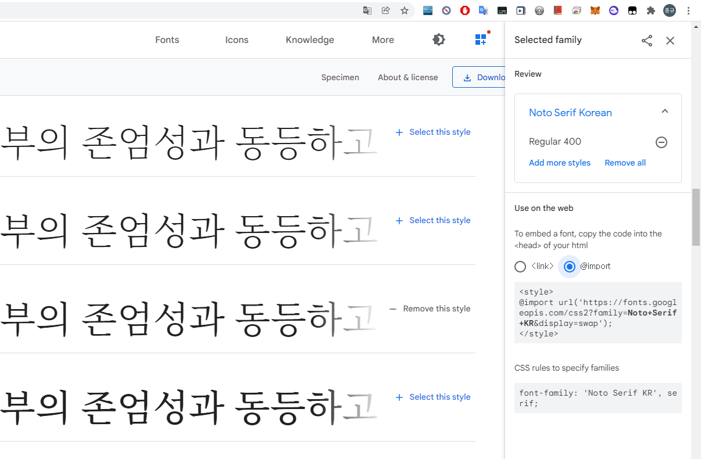

## 폰트 고르기

우선 무료 웹 폰트 사이트에서 사용할 폰트를 고른다.

- [Google Font](https://fonts.google.com/)
- [눈누](https://noonnu.cc/index)

### 눈누에서 폰트 가져오기

눈누에서 원하는 폰트를 클릭하면 웹 폰트로 사용이라는 부분이 있는데 여기 내용을 임포트해야 한다.

```
@font-face {
    font-family: 'GowunDodum-Regular';
    src: url('https://cdn.jsdelivr.net/gh/projectnoonnu/noonfonts_2108@1.1/GowunDodum-Regular.woff') format('woff');
    font-weight: normal;
    font-style: normal;
}
```

@font-face 적용하는 방법 찾아보기

### Google Font에서 폰트 가져오기



variable.scssPermalink
$serif: "Coming Soon", Georgia, Times, serif !default;
$sans-serif: "Iropke Batang", -apple-system, BlinkMacSystemFont, "Roboto", "Segoe UI",
"Helvetica Neue", "Lucida Grande", Arial, sans-serif !default;
$monospace: "Nanum Gothic Coding", Monaco, Consolas, "Lucida Console", monospace !default;
$cute: "Cafe24Oneprettynight" !default;
내가 사용하고 있는 minimal-mistake 테마는 📜_variable.scss 파일에 전체적인 css 파일들이 사용할 “전역 변수”를 한데 모아 선언하고 있다. $serif, $sans-serif, $monospace 는 minimal-mistake 자체에서 원래 있던 변수이고 $cute는 내가 만든 변수이다.(대충 지었다..) 이 변수에 위에서 알아낸 “폰트 이름”들을 맨 왼쪽에 적어준다. 왼쪽에 적힌 폰트일 수록 우선순위를 높게 설정해주는 것이기 때문에 폰트가 블로그에 반영되기 위해선 가장 왼쪽에 써주어야 한다.

내가 설정한 변수로 예를 들자면

font-family: $serif;
이 CSS 영역의 폰트는 “Coming Soon” 폰트가 될 것이고

font-family: $monospace;
이 CSS 영역의 폰트는 “Nanum Gothic Coding” 폰트가 될 것이고

font-family: $cute;
이 CSS 영역의 폰트는 “Cafe24Oneprettynight” 폰트가 될 것이다!

이렇게 변수로 대입하지 않고 직접 font-family: "Roboto"; 이런식으로 해줘도 상관없다!
