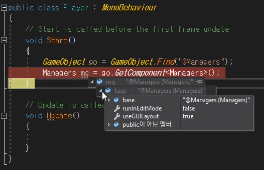
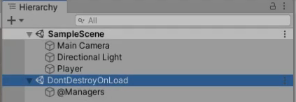

Player 클래스에서 Manager를 어떻게 가져와야 할까?

Unity Tool에서 특정 UI가 눌러졌을때 어떤 동작을 하는지는 모두 코드로 만들어서 관리한다. 따라서 똑같은 기능을 코드를 사용해서 구현할 수 있다.

Player.cs

```cs
public class Player : MonoBehaviour
{
    void Start()
    {
        // GameObject.Find는 이름으로 GameObejct를 찾아줌
        GameObejct go = GameObject.Find("@Managers");
        Managers mg = go.GetComponent<Managers>();
    }

    void Update()
    {

    }
}
```



위처럼 GetComponent를 사용해 Manager를 뽑아올 수 있다.

하지만 `GameObejct go = GameObject.Find("@Managers");` 부분처럼 GameObject를 이름으로 찾는건 부하가 심해 자주 사용하면 안된다.

## Singleton

특정 클래스의 인스턴스가 하나만 있기 원할때 사용한다.

```cs
public class Managers : MonoBehaviour
{
  static Managers Instance; // static으로 유일성이 보장
  public static Managers GetInstance() { return Instance; } // 외부에서 GetInstance() 통해서만 유일한 Instance(매니저)를 가져옴

  void Start()
  {
    Instance = this; // Instance를 채워줌(처음 생성된 Managers Component )
  }
}

```

하지만 여기서 만약 @Managers Object가 여러개 복사되어 있는 경우라면 각각의 객체별로 Managers 스크립트를 들고있기 때문에 매번 Instance를 덮어쓰는 일이 발생한다.

@Managers를 우리가 사용할 Manager로 지정하고, @Managers GameObject의 Component를 Instance로 지정해 주면 좀전의 매번 Instance를 덮어쓰는 문제는 해결된다.

Managers.cs

```cs
public class Managers : MonoBehaviour
{
  static Managers Instance; // static으로 유일성이 보장
  public static Managers GetInstance() { return Instance; } // 외부에서 GetInstance() 통해서만 유일한 Instance(매니저)를 가져옴

  void Start()
  {
      GameObejct go = GameObject.Find("@Managers");
      Instance = go.GetComponent<Managers>();
  }
}

```

Players.cs

```cs
public class Player : MonoBehaviour
{
  void Start()
  {
    Manager mg = Manager.GetInstace(); // GetInstace()를 호출
  }

  void Update()
  {

  }
}
```

만약 @Managers가 지워져서 없는 상태로 실행하면 Manager.GetInstace()가 null을 return 하므로 이후에 매니저에 접근해서 뭔가 추가하려고 하면 Crash가 나게 된다. 이 문제를 해결해보자.

Manager.cs

```cs
public class Managers : MonoBehaviour
{
  static Managers s_instance; // static으로 유일성이 보장
  public static Managers Instance { get { Init(); return s_instance; } }// 외부에서 Instance 통해서만 유일한 s_instance(매니저)를 가져옴

  void Start()
  {
      Init()
  }

  void Update()
  {

  }

  void Init()
  {
      if( s_instance == null)
      {
          GameObejct go = GameObject.Find("@Managers");

          if( go == null )
          {
              go = new GameObject { name = "@Managers" };
              go.AddComponent<Managers>();  // Managers Component를 붙여줌
          }
          DontDestroyOnLoad(go); // @Managers GameObject를 왠만해서는 삭제되지 않도록 변경
          s_instance = go.GetComponent<Managers>();
      }
  }
}

```

Player.cs

```cs
public class Player : MonoBehaviour
{
  void Start()
  {
    Manager mg = Manager.Instance; // Instance를 가져옴
  }

  void Update()
  {

  }
}
```

Managers가 먼저 호출되서 Start()가 실행되면 Init()가 실행되고, Start()가 호출되기 이전에 다른곳에서 GetInstance()를 먼저 호출하면 Init()가 실행되서 만들어진 Instance를 반환한다.



DontDestroyOnLoad()를 호출하면 GameObject가 DontDestroyOnLoad 아래에 따로 붙어있게 되고 Scene 이동을 하더라도 삭제되지 않는다.

Unity 버전이라 정통 Singleton이랑 조금 다르지만 핵심적인 내용은 비슷하다.
