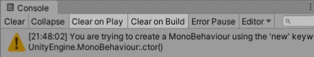

규모가 큰 게임에서는 게임 전체를 관리하는 Manager를 만든 다음에 거기 UI, Network 등의 기능을 언제, 어디서든 사용할 수 있도록 만들어 주는 경우가 많다.

기본 C# Script를 만들고 다른 클래스에서 Manager의 인스턴스를 만들어 보자.

Manager.cs

```cs
public class Managers : MonoBehaviour
{
    void Start()
    {

    }

    void Update()
    {

    }
}
```

Test.cs

```cs
public class Test : MonoBehaviour
{
    void Start()
    {
        Managers mg = new Managers();
    }

    void Update()
    {

    }
}
```

이 상태에서 실행을 하면 Console 창에 MonoBehaviour를 new로 생성하려고 한다는 경고메세지가 뜬다.



MonoBehaviour의 상속 관계를 보면 MonoBehaviour -> Behaviour -> Component -> Object 순이다. Component는 GameObject에 붙을 수 있는 모든것의 Base(부모) 클래스이다. C# 파일을 만든다고 Component로 GameObject에 붙일 수 있는것이 아니라 반드시 MonoBehaviour를 상속받아야 이 스크립트 파일을 Component로 인식해서 Unity 툴에서 사용할 수 있다.

지금 만들려고 하는 Manager는 Component 용도의 클래스는 아니다. MonoBehaviour 상속받은 부분을 지워주면 우선 실행할때 경고메세지는 해결된다.

이제 설계적인 문제가 남는데 Start(), Update()는 부품으로 들어가 있을때만 Unity가 Component로 인식해서 실행시에 Update()와 Start()를 찾아주는 것이다. 따라서 MonoBehaviour를 상속하지 않는 일반적인 Class로 만들었을때는 Start와 Update가 자동으로 호출되지 않는다.

게임이 시작되는 시점에 Manager에서 초기화 작업이 필요하다. 일반적으로 C#에서 사용하는 Program.cs의 Main 함수에서 초기화를 하면 되지만 유니티에서는 Main 함수가 숨겨져 있다.

여기서 팁이 나오는데, Scene에 배치하는 GameObject는 꼭 실체가 있는 사물일 필요가 없다.


이전에 Hierarchy에서 여러 물체를 배치했는데, 처음에는 실제 게임에 나타나는 것들만 넣으려는 경향이 있다. 하지만 실체가 없고 추상적인것도 배치할 수 있다.
빈 GameObject를 만들어서 Scene에 배치하고 Manager에 다시 MonoBehaviour를 상속해서 Manager.cs 스크립트를 빈 GameObject에 Component로 붙여 준다. 그리고 빈 GameObject를 전체에서 접근할 수 있는 매니저 용도로 사용하면 된다.


이 GameObject의 이름을 @Managers로 변경하자. (없어지면 안된다는 의미로 "@"를 붙임)
