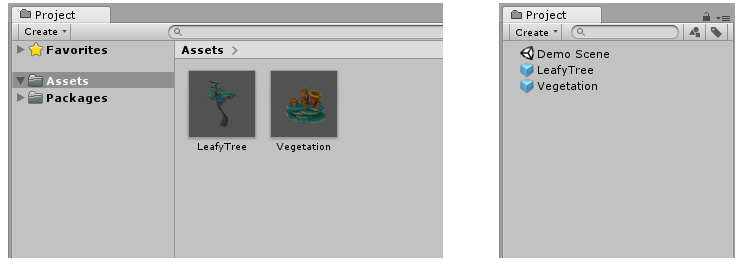

## 프리팹

### 프리팹 정의와 생성

오브젝트를 에셋 파일로 만들어 두는 것을 Prefab 이라고 한다. 만들어 둔 프리팹을 CLone 화 하여 씬에 실존하는 오브젝트로 찍어낼 수 있다.

프리팹을 이용하여 게임 도중에도 실시간으로, 프리팹으로 오브젝트를 씬 상에서 실존하도록 찍어내어 생성할 수 있고, 프리팹 하나로 수 많은 동일한 오브젝트들을 동시에 생성할 수도 있다. Class를 만들어 두고 이럴 인스턴스로 찍어내는 것과 같다. 프리팹은 오브젝트와 다르게 게임 상에 실존하는게 아니라 오브젝트를 찍어내는 틀이라고 생각하면 된다.

- 프리팹 만드는 방법
  - 프리팹 에셋을 생성하려면 Hierarchy 창의 게임 오브젝트를 Project 창으로 드래그한다
  - 게임 오브젝트 및 그와 관련된 모든 컴포넌트와 자식 게임 오브젝트가 Project 창에서 새로운 에셋이 된다
  - 프로젝트 창에 썸네일 뷰 or 파란색 큐브의 프리팹 아이콘으로 표시된다
    
  - 프리팹 에셋을 생성하면 원본 게임 오브젝트가 프리팹 인스턴스로 변한다
  - 프리팹 인스턴스는 Hiearachy에서 파란색 텍스트로 표시된다
- 프리팹을 Scene에 오브젝트로서 찍어내기 (Clone 만들기)
  - 마찬가지로 Hierarchy 혹은 Scene 창에 프리팹을 드래그하여 프리펩 인스턴스를 생성한다.
  - 코드 상으로는 Instantiate() 함수를 사용하여 프리팹을 오브젝트로 실존하게 찍어낼 수 있다.
- 프리팹 수정하는 방법
  - Project 창에서 프리팹을 더블 클릭
  - Hierarchy 창의 프리팹 옆에 있는 화살표 버튼 사용
  - 프리팹 에셋의 Inspector 창에 있는 “Open” 버튼 클릭
    
  - 프리팹 모드를 시작하면 Scene 뷰와 Hierarchy 창에 해당 프리팹의 콘텐츠만 표시된다
    

### 프리팹 오버라이딩
