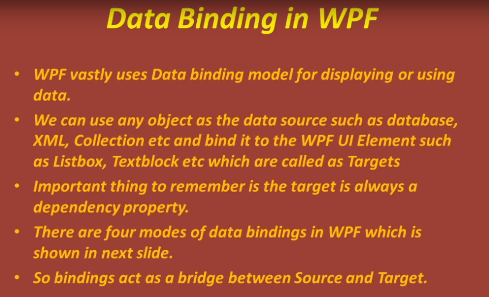
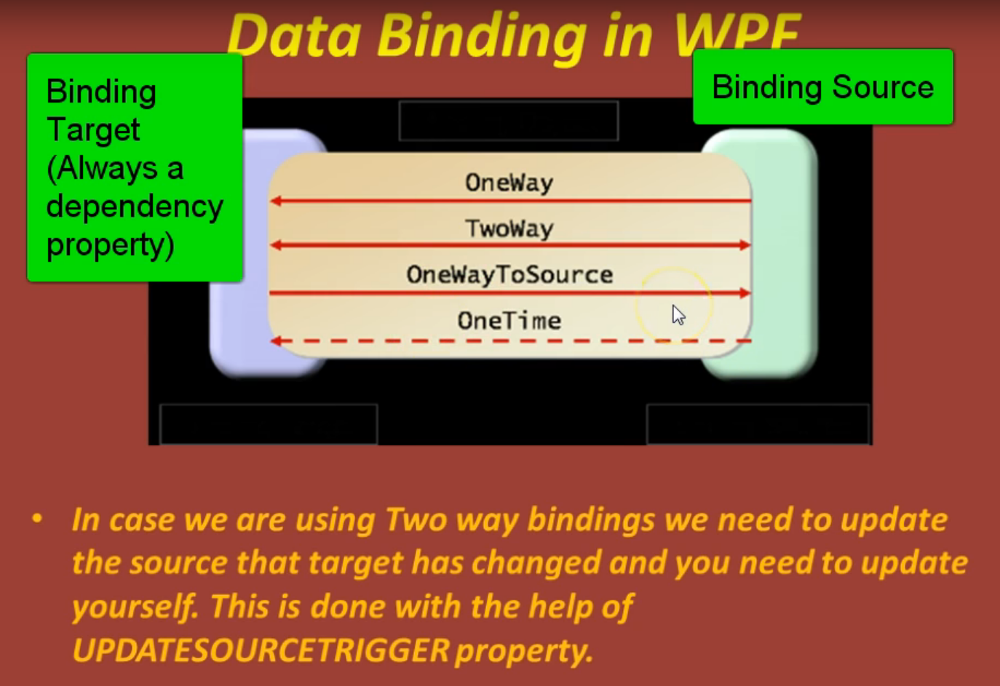

## Data Binding in WPF

WPF vastly uses data binidng model for displaying or using data.

We can use any object as the data source such as database, XML, Collection etc and bind it to the WPF UI Element such as Listbox, Textblock etc which called as Targes.

Important thing to remember is the target is always a dependency property.

There are four modes of data binidngs in WPF which is shown in next slide.

So bindings act as a bridge between Source and Target

WPF는 데이터를 표시하거나 사용하기 위해 데이터 binidng 모델을 광범위하게 사용합니다.

데이터베이스, XML, Collection 등과 같은 데이터 소스로 모든 개체를 사용할 수 있으며 이를 Targes라고 하는 Listbox, Textblock 등과 같은 WPF UI 요소에 바인딩할 수 있습니다.

기억해야 할 중요한 점은 대상이 항상 종속성 속성이라는 것입니다.

다음 슬라이드에서 볼 수 있는 WPF에는 네 가지 데이터 binidng 모드가 있습니다.

따라서 바인딩은 소스와 타겟 사이의 다리 역할을 합니다. 타겟은 항상 Dependency Property입니다.

In case we are using Two way bindings We need to update the source that target has changed and you need to update youtself. This is done with the help of UPDATESOURCETRIGGER property.

양방향 바인딩을 사용하는 경우 타겟이 변경된 소스를 업데이트해야 하며 스스로 업데이트해야 합니다. 이것은 UPDATESOURCETRIGGER 속성의 도움으로 수행됩니다.

- UpdateSourceTrigger는 Two way binding에서만 유효하다
