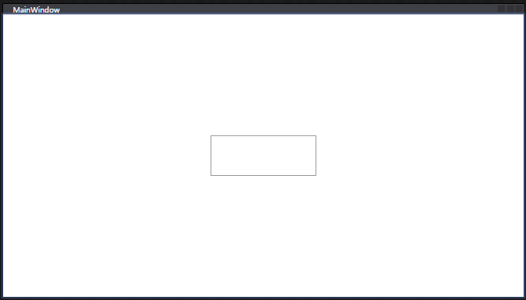
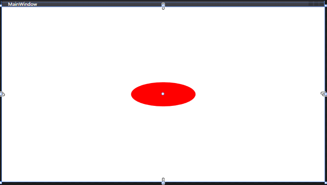

## Control Template in WPF

- Control Templates allow us to specify the visual structure of a control.
  - 컨트롤 템플릿을 사용하면 컨트롤의 시각적 구조를 지정할 수 있습니다.
- For example if we need to change the shape of our Button to ellipse or some other shape we can use Control Templates.
  - 예를 들어 버튼의 모양을 타원이나 다른 모양으로 변경해야 하는 경우 컨트롤 템플릿을 사용할 수 있습니다.
- On customizing our controls the content of controls are lost because WPF is not sure where to place the content on control.
  - 컨트롤을 사용자 지정하면 WPF가 컨트롤에 Content를 배치할 위치를 모르기 때문에 컨트롤의 콘텐츠가 손실됩니다.
- This problem is solved with the help of Content Presenter.
  - 이 문제는 Content Presenter의 도움으로 해결됩니다.
- Control Templates are generally applied with styles and triggers.
  - 컨트롤 템플릿은 일반적으로 스타일 및 트리거와 함께 적용됩니다.

```xml
    <Button Content="I'm a Button" Height="60" Width="160" Click="Button_Click">
        <Button.Template>
            <ControlTemplate>

            </ControlTemplate>
        </Button.Template>
    </Button>
```

Button.Template에 ControlTemplate를 지정하는 순간 버튼의 모양이 아래와 같이 사라진다.



ControlTemplate 내부에 아직 아무것도 작성하지 않았기 때문에 WPF는 ControlTemplate 내부에 있는 내용을 이해하지 못한다.

```xml
    <Button Content="I'm a Button" Height="60" Width="160" Click="Button_Click">
        <Button.Template>
            <ControlTemplate>
                <Ellipse Fill="Red"/>
            </ControlTemplate>
        </Button.Template>
    </Button>
```



ControlTemplate 내부에 `<Ellipse Fill="Red"/>`를 넣으면 빨간 타원모양 버튼이 되고 클릭하면 <Button.Template>를 지정하기 전과 동일하게 작동한다.

그런데 Button의 Content 속성으로 준 "I'm a Button"이 보이지 않는다. 일단 Button의 Template가 변경되면 WPF는 어디에 content를 배치해야할지 모르기 때문에 content를 잃는다. 이 문제는 Content Presenter의 도움으로 해결된다.

WPF는 ControlTemplate 내부에 작성한 내용이 버튼에 적용된다는 사실을 모르기 때문에 Content가 표시되지 않는다. `<ControlTemplate TargetType="Button">`를 지정해 주면 WPF는 이 ControlTemplate이 버튼에 적용되었음을 이해하고 버튼의 content를 제공합니다. (이 부분 더 자세히 이해할것!)

```xml
    <Button Content="I'm a Button" Height="60" Width="160" Click="Button_Click">
        <Button.Template>
            <ControlTemplate TargetType="Button">
                <Grid>
                    <Ellipse Fill="Red"/>
                    <ContentPresenter VerticalAlignment="Center" HorizontalAlignment="Center"></ContentPresenter>
                </Grid>
            </ControlTemplate>
        </Button.Template>
    </Button>
```

컨트롤 템플릿은 일반적으로 스타일 및 트리거와 함께 적용됩니다.

```xml
	<Window.Resources>
		<Style TargetType="Button">
			<Setter Property="Template">
				<Setter.Value>
					<ControlTemplate TargetType="Button">
						<Grid>
							<Ellipse Fill="Red"/>
							<ContentPresenter VerticalAlignment="Center" HorizontalAlignment="Center"></ContentPresenter>
						</Grid>
					</ControlTemplate>
				</Setter.Value>
			</Setter>
		</Style>
	</Window.Resources>
    <Grid>
		<Button Content="I'm a Button" Height="60" Width="160" Click="Button_Click">
		</Button>
	</Grid>
```

- When we put a Content Presenter into a control template, WPF shows the control's content wherever the content presenter says.
  - Content Presenter를 컨트롤 템플릿에 넣으면 WPF는 Content Presenter가 말하는 곳마다 컨트롤의 콘텐츠를 표시합니다.
- Control Templates appear similar to styles but they differ in the sense that in a style we set properties of a control.
  - 컨트롤 템플릿은 스타일과 유사하게 보이지만 스타일에서 컨트롤의 속성을 설정한다는 점에서 다릅니다.
- In control template we define the Ul of the control and use the properties (and their values) that are set in the style.
  - 컨트롤 템플릿에서 컨트롤의 Ul을 정의하고 스타일에 설정된 속성(및 해당 값)을 사용합니다.

좀 더 풀어서 설명해 보면 컨트롤에는 Background, Foreground 등 많은 속성이 있다. Style에서 이런 속성을 설정하여 컨트롤의 모양을 변경할 수 있다. 예를들어 버튼의 Background 속성을 setting해서 배경색을 파란색으로, FontStyle 속성을 설정해서 글꼴을 굵게 설정할 수 있다. 하지만 속성을 통해 변경할 수 있는 사항은 제한적이다. 버튼의 속성을 변경하는것 이상으로 사각형인 버튼을 원형으로 만드는 등의 customize를 하려면 ControlTemplate를 만들어야 한다.
