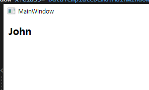

## Data Template In WPF

MainWindow.xaml

```xml
<Label Content="Simple Label displaying string text" Foreground="Blue"/>
```

- Since this content here is a simple string so WPF engine understands this string text. That is why this string text is being able to be displayed without any data template.
- 이 내용은 간단한 문자열이므로 WPF 엔진은 이 문자열 텍스트를 이해합니다. 이것이 이 문자열 텍스트가 데이터 템플릿 없이 표시될 수 있는 이유입니다.

MainWindow.xaml

```xml
<Label Content="{Binding obj}" Foreground="Blue" FontWeight="Bold"/>
```

MainWindow.xaml.cs

```cs
namespace DataTemplateDemo
{
    public partial class MainWindow : Window
    {
        public Person obj { get; set; }
        public MainWindow()
        {
            InitializeComponent();

            obj = new Person()
            {
                Name = "John"
            };

            this.DataContext = this;
        }
    }

    public class Person
    {
        public string Name { get; set; }
    }
}
```


WPF는 object를 화면에 어떻게 표시해할지 모른다. WPF는 string content를 화면에 표시하는 방법만 이해한다. 그래서 이전의 예시처럼 string content는 화면에 표시되었지만 지금 예시에서 object를 바인딩한 경우 원하는 화면을 얻지 못한다. object의 Fully qualified Name을 보여준다.

```cs
    public class Person
    {
        public string Name { get; set; }

        public override string ToString()
        {
            return "" + Name;
        }
    }
```


데이터 템플릿을 정의하지 않으면 WPF는 화면에 개체를 표시하는 방법을 이해하지 못하므로 해당 개체에 대해 .ToString() 메서드를 호출한다. 하지만 객체가 많아지면 객체의 수만큼 ToString 메서드를 override해야하므로 이 방법은 어렵다.

DataTemplate를 사용하면 이러한 문제를 해결할 수 있다.

```xml
    <Label Content="{Binding obj}" FontSize="20" Foreground="Green" FontWeight="Bold">
        <Label.ContentTemplate>
            <DataTemplate>
                <Label Content="{Binding Name}"/>
            </DataTemplate>
        </Label.ContentTemplate>
    </Label>
```



DataTemplate를 사용해 객체를 출력했다. Label에 FontSize와 Foreground 값을 주었지만 실제 표시하는 내용은 DataTemplate안의 Label이다.(여기서 FontSize와 FontWeight는 적용되는데 Foreground만 적용 안되는 이유를 모르겠음)

Fontsize, Foreground, FontWeight를 DataTemplate 안의 Label로 옮겨 주면 스타일이 정상적으로 적용된다.

```xml
    <Label Content="{Binding obj}" >
        <Label.ContentTemplate>
            <DataTemplate>
                <Label Content="{Binding Name}" FontSize="20" Foreground="Green" FontWeight="Bold"/>
            </DataTemplate>
        </Label.ContentTemplate>
    </Label>
```


Window.Resource에 DataTemplate를 선언하고 Key를 이용하여 Template를 여러번 사용할 수도 있다.

```xml
<Window.Resources>
    <DataTemplate x:Key="MyTemplate">
        <Label Content="{Binding Name}" FontSize="20"
        Foreground="Green" FontWeight="Bold"/>
    </DataTemplate>
</Window.Resources>
<Grid>
    <ContentPresenter Content="{Binding obj}"
    ContentTemplate="{StaticResource MyTemplate}">
    </ContentPresenter>
</Grid>
```

결론 : DataTemplate는 복잡한 타입의 데이터를 시각화 하는데 도움을 준다.

> DataTemplate와 ContentTemplate, ContentPresenter 개념 다시 정리하자
